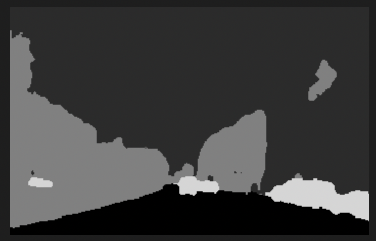
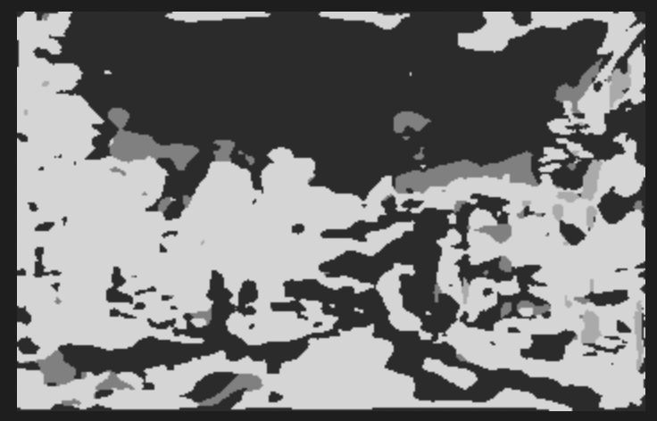
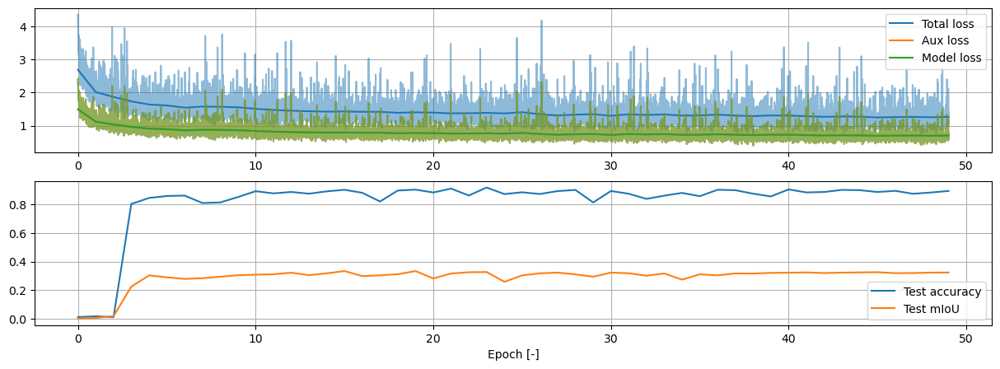
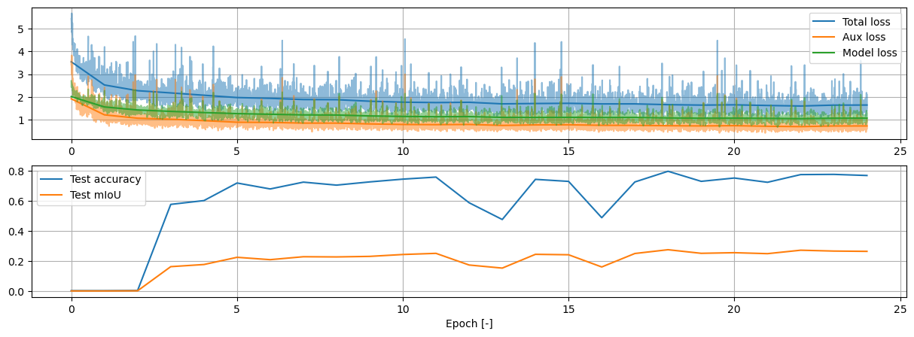
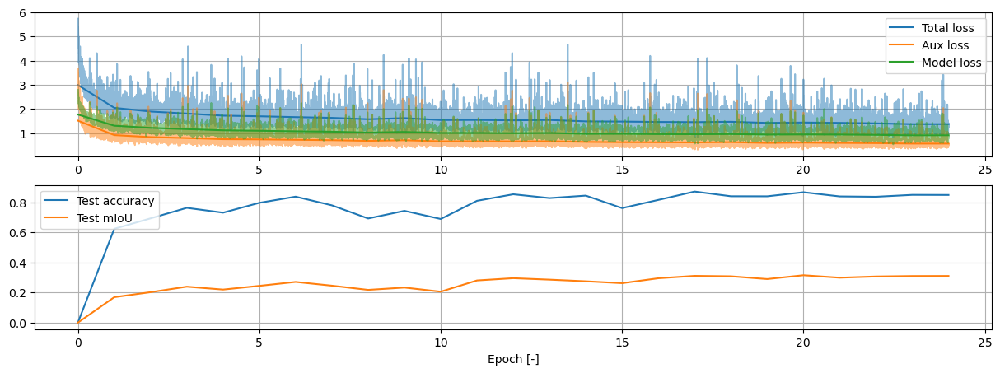
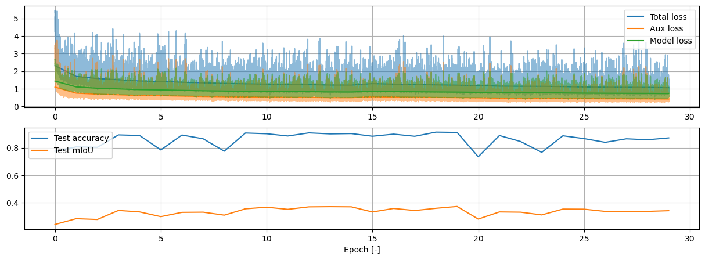
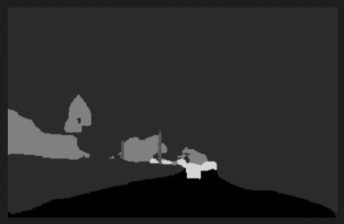
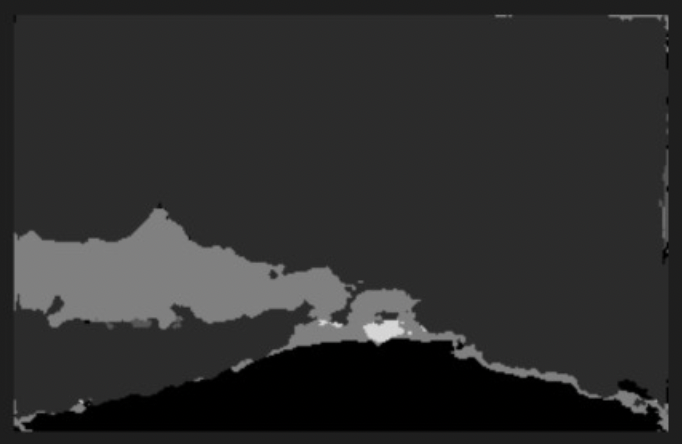

# A Reproduction of EV-SegNet: Semantic Segmentation for Event-based Cameras

<b><i>
In 2018, a method was proposed by Iñigo Alonso and Ana C. Murillo for the semantic
segmentation of scenes from the DDD17 dataset (DAVIS Driving Dataset). Semantic
segmentation (i.e. labelling different types of objects in an image) of street scenes had
been a common application for deep neural networks. 
So then what was the catch? Whereas traditional methods use camera images as input,
EV-SegNet uses event-based data, a datatype that is notoriously unintuitive and hard to
interpret for both human and computer brains. As if the challenge was not large enough
yet, no existing labeled dataset was available (at the time). 
In the context of the 'Reproducibility project' for the Deep Learning course at Delft
University of Technology, we attempted to reproduce the results presented in Alonso and
Murillo's paper. This blogpost aims to clarify the main concepts from the original paper
and presents the reproduction results.
</i></b>

## Background Information

In order to make sure that the methodology in the original paper [^1] and reproduction is
clear, we will shortly go over some key concepts essential to understanding the process.

### Event-based cameras

What are event-based cameras? In contrast to traditional camera sensors, event-based
sensors capture, well... events. Simply said: a *normal* camera captures the intensity of
light at a certain location (pixel) on the sensor, the sensor records these intensities at
all pixels at once, some interpretation of these values later, we have an image. In any
case, the idea is that the photograph contains a snapshot in time of this light intensity
data. Event-based sensors, however, only capture *changes* in intensity at a certain pixel
and at a certain time.

Consider the image below, in the top row we see a representation of a classic camera
image: as can be seen, the orange star moves slightly to the left from frame 1 to frame 2,
however, based on a single frame we would never know if the star was moving, they are
snapshots in time. The bottom row are the event-based representations of the top row: at
the first timestep, no changes are noted. At the second step, once the star has moved,
some receptors observe a _change_ in intensity.

Important to note is that this representation of event-based images already show a certain
interpretation of the event data! In fact, data from event-based cameras can hardly be
called an image. The data consists of data points, each containing a timestamp, a location
on the sensor, and a measure of the intensity change. Depending on the interpretation of
the intensity change, different representations of event-based data can be obtained.
[This link](https://www.youtube.com/watch?v=MjX3z-6n3iA) provides an example of
event-based cameras in action.

### Semantic (pixel level) image segmentation

Semantic segmentation is the process whereby images are segmented and labeled (through a
machine learning process) according to object types/classes that are relevant to the
application. In the example below (obtained from
the [CityScapes Dataset](https://www.cityscapes-dataset.com/examples/)), the classes could
be _car_ (blue), _cyclist_ (red) and _road_ (light purple) among others.

## Original method

### Event Representation

As mentioned, the representation of event data depends heavily on the manner in which it
is processed. The most common way to present event data corresponding to a certain
time-step _ti_ as an image is to arrange the data points in an image grid
according to the recorded positions _x_ and _y_, each of these pixels contain information
on the events that took place during some time interval containing _ti_.

As a reference, this image aims to clarify the concept: A white pixel conveys the absence
of a datapoint (i.e. no event was recorded at that time, at that location).

The nature of the information in a pixel varies from method to method, for example one
could take the integral of the events in the time interval. Additionally, different kinds
of information can be stored in different channels, the same way RGB images' pixels record
the intensity of red, green and blue wavelengths. For example, 2 channels can separate
positive and negative events.

The method that was proposed stores the event information in 6 channels. The first one is
a histogram, it simply accumulates all the magnitudes of the events over the time
interval, summing them together. Second is the mean of all events in the time interval and
third the standard variation. These three methods all split the information into a
positive and a negative channel, resulting in 6 channels.

Please note that the colours in the figure are only meant to signify the various channels,
they do not convey actual values, nor are the channels interpreted as colours in the
original method. Below an example[^1] of three negative channels can be found.

### Ground truth labels

One of the main challenges that Alonso and Murillo faced, was the scarcity of available
data. The [DDD17 Dataset](http://sensors.ini.uzh.ch/news_page/DDD17.html)
was one of the few event-based datasets for driving environments. The data contains
greyscale images alongside the event-data, however it does not contain ground truth
labels.

As to avoid having to generate the label by hand, which is not only time-consuming but can
be quite difficult as well, they employed a CNN and trained it on grayscale images from
the CityScapes Dataset (that _did_ have ground truths) to generate labels on the greyscale
images that accompany the DDD17 event-data. These results had an MIoU score of 83% which
they deemed sufficient to serve as ground truths for the event data.

### CNN architecture

Since CNN architectures are well known for their good performance on segmentation tasks,
the method proposed in the paper employed an architecture heavily inspired on such. The
architecture made use of the Xception[^2] model as an encoder and used backpropagation on
the per-pixel cross-entropy loss to optimize the model.

### Their results

| Input                | Accuracy (50ms) | MIoU (50ms) | Accuracy (10ms) | MIoU (10ms | Accuracy (250ms) | MIoU (250ms) |
|----------------------|-----------------|-------------|-----------------|------------|------------------|--------------|
| Event representation | 89.76           | 54.81       | 86.46           | 45.85      | 87.72            | 47.56        |
| Grayscale image      | 94.67           | 64.98       | 94.67           | 64.98      | 94.67            | 64.98        |
| Combined             | 95.22           | 68.36       | 95.18           | 67.95      | 95.29            | 68.26        |

An example of the segmentation result for three different event integration intervals:
10ms, 50ms and 250ms:

## Reproduction

The goal of our reproduction[^4] is to attempt to make their method robust for the future:
back in 2018, Alonso and Murillo built their method on Python 2.7 and TensorFlow 1.11
structures. We attempted to adapt their code[^3] to be compatible with Python 3.x and
TensorFlow 2.7. The model was then trained from scratch, using the data provided with the
original paper. Additionally, we checked the performance of the algorithm when provided
with newly generated ground truth labels for the testset.

<!--
[What we did :

- [ ] Replicated: A full implementation from scratch without using any pre-existing code.
- [x] Reproduced: Existing code was evaluated
- [ ] Hyperparams check: Evaluating sensitivity to hyperparameters.
- [x] New data: Evaluating different datasets (for label generation) to obtain similar
  results.
- [ ] New algorithm variant: Evaluating a slightly different variant.
- [x] New code variant: Rewrote or ported existing code to be more efficient/readable.
- [ ] Ablation study: Additional ablation studies.

]
-->

### Compatibility

The method that was implemented was using an outdated version of python 2, together with
the by now outdated 1.x version of tensorflow. Thus we systematically looked at the
outdated functions and methods and converted these to work with tensorflow 2.8 and python
3.x. Most of the changes we made were to the file generating the segmentation labels from
the output images, and the file which trains the model. Luckily tensorflow 2.8 contains
compatability functions which operate identically to the older functions from tensorflow
1.x.

### Using a SOTA SegNet for generating labels

The model used in the original work to generate ground truths has been surpassed by higher
accuracy pre-trained models. We elected to use a newer 'pspnet_101' model trained on
cityscapes, to see
whether the model was somehow very sensitive to intricacies due to the original model used
to generate segmentation images. This newer model was trained to generate more than 6
classes, we grouped certain classes together to match the 6 classes used in the paper. The
following labels were merged:

* _road_ and _sidewalk_ into _**flat**_
* _building, wall, fence_ and _sky_ into _**background**_
* _pole, traffic light_ and _traffic sign_ into _**object**_
* _vegetation_ and _terrain_ into _**vegetation**_
* _person_ and _rider_ into _**human**_
* _car, truck, bus, train, motorcycle_ and _bicycle_ into _**vehicle**_

### Issues with reproduction

Several issues were encountered in the reproduction process which are caused by
insufficient information, namely:

- The authors did not specify the exact network architecture in the paper, noting only
  that an Xception encoder is used and that a 'light decoder' is built,
  _"concentrating the heavy computation on the encoder"_. The repository from the paper's
  authors includes multiple architectures. The model 'Segception\_small' is used by
  default, but there are reasons to believe why the default in the code is not necessarily
  the model that was used in the paper, see below.
- The paper references using auxiliary loss during training, this is a common method to
  combat vanishing gradients in deep models. The '\_small' model however does not properly
  implement an auxiliary loss (in the code it's simply a copy of the normal model loss).
  Two models in the given repository did properly implement an auxiliary loss, one of
  which did not use Xception as a base model and hence does not match the paper, the other
  was so large that our computation resources were insufficient without sacrificing on
  batch size. We have implemented an auxiliary loss on the '\_small' model ourselves and
  noticed a decrease in performance, see below. We are unsure whether auxiliary loss has
  actually been used for the results in the paper.
- Not all hyperparameters are fully specified in the paper, most noticeably the exact
  number of epochs and what type of polynomial scheduling was used. The default number of
  epochs is 500 in the repository (the paper mentions 30k iterations, which would be
  around 15 epochs). This adds to the reasons (as above) we have to believe that the
  defaults in the repository are not necessarily what's been used for the results in the
  paper.
- The given event data has already been processed, simply supplied as _.npy_ files. The
  code for the pre-processing steps is not included in the given repository. This means
  that the time used for differences in the event data (the 50ms, 250ms, ...) in the table
  above is not fully reproducible with supplied code. Although it is given in the paper that the model
  was trained on event data with integration intervals of 50ms, they also mention that
  it was tested on 10ms, 50ms and 250ms, but neglect to specify which test data
  corresponds to which intervals.
- The authors are unclear about how they integrated grayscale and event data for the final
  row in the table above.
- The given 'best' weights in the repository do not actually result in the given results
  in the paper, the accuracy and mIoU with just inference over those given weights are
  significantly lower. Refer to the results.
- No learning curves are presented in the paper, only final outcomes. Given that there are
  some things that are unclear or, having reference learning curves could
  have helped to see whether we're on the right track with the model used for the results
  in the paper.

There were also issues from our side:

- Computation resources were limited, which meant we weren't able to use the bigger models
  in the repository with the given batch size (limited by video memory). Again, we are unsure what model has
  actually been used as the authors don't provide a detailed description.
- Related to this, we did not manage to get Google Colab to work with the given credits.

### Results
As explained, the codebase has been updated to match up-to-date frameworks and tooling, several other modifications have been made to allow more parameterization, fix several bugs/annoyances and get model storing/saving to work properly. Please review the commit history in the fork [^4] for more info.

We will first present results using the given pre-trained model from the authors. Then present results from our own training with varying amounts of data, and then from our own training with 100% data and a proper auxiliary loss as described in the paper.

**Using the pre-trained model from the authors**

Using the pre-trained model in the repository, which the authors state should be able to 'replicate results' [^3] does not get the expected results. On a limited test set of 500 samples, we achieve an accuracy of ~20% and a mean intersection-over-union (mIoU) of under 5%. The resulting segmentation images naturally do not represent the labels at all:

  
   

**Training the model ourself with- and without auxiliary loss**

At first, we trained the model using the defaults in the repository, this resulted in an accuracy of around 85% and an mIoU of around 30%. This model was trained without auxiliary loss (which, as mentioned, was not implemented in the code base but is mentioned in the paper) and uses 25% of the training samples (500 samples) for 50 epochs (25k iterations), see below loss curves:

    

Naturally this model uses less iterations than prescribed in the paper, less training samples and does not use auxiliary loss. We first implemented an auxiliary loss properly and reran training for 25 epochs with 10% and 25% of the training data, to evaluate to what extent adding training samples improved performance. This resulted in the following loss curves for 10% and 25%, respectively:

    

    

Note that training with 25% of the training samples did result in marginally better test accuracy and mIoU, as well as increased stability during training. Although the accuracies are fairly close to the author's results, the mIoU is significantly lower, this still results in segmentation labels with little value.

Finally, we trained with 100% of the training samples for 30 epochs, so 60k iterations, twice as much as the authors claim in the paper, which resulted in the following loss curves:

    

Notice that the final performance is only marginally better on the test set than our results for 25% of the training data. One thing we did notice at this point is that the accuracy and mIoU on the training set are increasing as the number of epochs goes up, resulting in segmentation outputs that start to visually resemble the given labels on the training set. The label is the left image, the model output is on the right.

  
   

Clearly, then, the fact that we are using the 'segception\_small' (because, as mentioned, which of the models is actually used is not clear from the paper) from the repository is not a large problem as the model is complex enough to start overfitting on the training data. Increasing model complexity might not get us better results on the test set.

**Training times**

The authors provide no information regarding hardware used for training and the required training time. A single iteration took around 1.1s on an M1 Macbook Pro with Metal acceleration, resulting in training time of around 19 hours for the 60k iterations above.

**Reproduction conclusion**

In conclusion, we are not able to replicate the results from the authors on multiple fronts:
- Inference on the pre-trained weights supplied by the authors does not result in the figures presented in the paper.
- Training the model ourselves does not result in the figures presented in the paper. Even when trying to train for longer than the authors prescribe or adding a proper auxiliary loss as the authors also describe in the paper.
- Event data with different time constants is not supplied, nor is the pre-processing code, hence we simply are not able to replicate these results using this codebase without writing fairly complex event-camera data processing code ourselves. Even in that case, the raw data was not provided by the authors.

We are unsure where this discrepancy is coming from. The codebase is largely the same, apart from optional changes (i.e. aux loss, less training samples, etc...) or compatibility changes. The dataset is the same as the author's used as well.

<!-- Naturally, there could be mistakes from our side in this reproduction. However, we've largely kept the existing codebase with only optional modifications (i.e. less training samples, better image output, aux loss) or compatibility modifications as well as the author's dataset. We are unsure where the discrepancy between our results and the author's results is coming from. -->

### Value of new test labels

As we mentioned before, generating new labels for the testset required merging some
predicted labels from the pretrained model. This was easier said than done however:
a bit of investigating showed that some 30-ish classes are defined for segmentation tasks
for driving scenery. Most applications, including the pretrained model, seem to use only
19 of those, but often neglect documenting which classes exactly. EV-SegNet then was
trained to only classify 6 classes, but at least mentions - albeit in passing - the
categories (and their subclasses) that were merged into their 6. The challenge was now to
identify the 19 classes used by the pretrained model. As it happens, in EV-SegNet's
`get_segmentation`[^3] 19 training labels are identified. Validating whether these 19 were
in fact also the ones used for the pretrained model was achieved by visual inspection of
the generated segmentations. The newly generated and merged 6-class-labels are thus
estimates at best.

Also, since we did not have the time to generate new ground truth labels for all
15k training samples (due to our computational limits mentioned above), we only
re-labeled the testset. Of course that means that there is a risk of a high disconnect
between what the model is trained for and what it is tested on. At most, we can consider
the performance on the new test labels as a measure of how robust the method is.

**Results on the new test set, do the (poor) results generalize?**

## Formalities

This reproduction was performed in the context of Delft University of Technology's course
on Deep Learning (CS4240, 2022 Q3). Our team consisted of three members: Rafaël Beckers, Evert De Vroey and
Roy Vorster.

Both Rafaël and Roy were mainly responsible for the technical aspects of this
reproduction: adapting the original code to be compatible with modern methods. Evert was
mainly responsible for communicating the results, namely writing this blogpost.

## References

[^1]: Iñigo Alonso and Ana C. Murillo. _Ev-segnet: Semantic segmentation for event-based
cameras_. 2018. URL: [https://arxiv.org/abs/1811.12039](https://arxiv.org/abs/1811.12039)

[^2]: F. Chollet. Xception: Deep learning with depthwise separable convolutions. 2017 IEEE
Conference on Computer Vision and Pattern Recognition (CVPR), pages 1800–1807, 2017.

[^3]: Iñigo Alonso and Ana C. Murillo.
[EV-SegNet Repository](https://github.com/Shathe/Ev-SegNet.git)

[^4]: Roy Vorster.
[Reproduction EV-SegNet Repository](https://github.com/RoyVorster/Ev-SegNet.git)_

